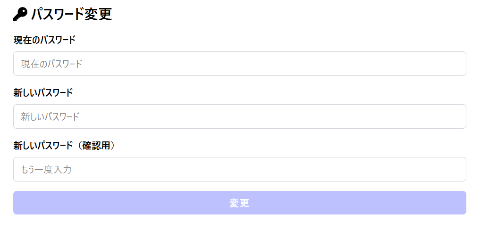

# 認証機能付きユーザー管理アプリ（セッションベース認証）

このプロジェクトは、セッションベース認証を用いたログイン・サインアップ・パスワード変更機能の学習目的で構築されたNext.jsアプリケーションです。

## 初めに

今回、開発したアプリのファイル数が100を超え、全体をアプロードすることが困難であったため、主に編集を行ったsrcファイルのすべてをアップロードしています。

操作の様子は撮影したスクリーンショットをご参照ください。

## 実装した機能一覧

- **ログイン機能**
- **サインアップ機能**
- **セッション管理によるユーザー認証**
- **パスワード変更機能**（後述の追加実装）
- **確認用パスワード入力機能**（後述の追加実装）

## 操作の様子
ホーム画面

クッキーの保存

サインアップ画面(パスワード確認付き)

サインアップ画面(操作ミス)

パスワード変更画面

## 🔧 認証の仕組み（セッションベース）

本アプリでは、**セッションベース認証**を採用しています。  
ログイン成功時にセッショントークンを発行し、サーバーサイドでセッションを管理することで、クライアントと認証状態を保持しています。  
セッション情報はクッキーに保存され、クライアント側ではアクセスできません。

## 追加実装した機能（課題対応）

以下の2点は、課題として要求された新規追加機能です：

1. **サインアップ時に確認用パスワード入力フィールドを追加**  
   - 入力された2つのパスワードが一致するかどうかを検証することで、誤入力を防止します。

2. **ログイン済みユーザーによるパスワード変更機能**  
   - 現在のパスワードを入力し、新しいパスワードへ更新できます。
   - 成功時にはアラートで通知し、セッションを維持したまま変更が反映されます。

## 使用技術

- **Next.js (App Router)**
- **TypeScript**
- **React Hook Form**
- **bcrypt**
- **セッション管理（Next.js API Route + Cookie）**

## 今後の展望

- CSRF対策の導入
- セッションタイムアウト機能
- ユーザー情報編集・削除機能

---

本プロジェクトは、セキュリティとユーザー体験の両立を目指し、**セッションベースの認証フロー**と**直感的なUI設計**の学習に最適な構成となっています。

